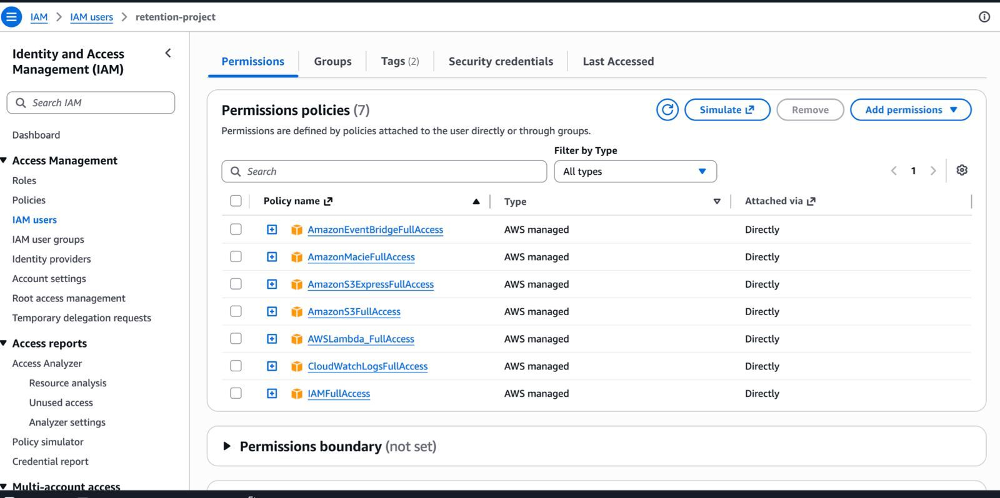
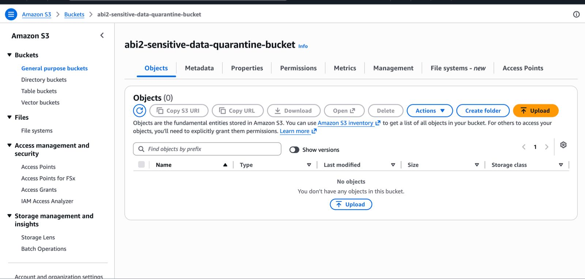
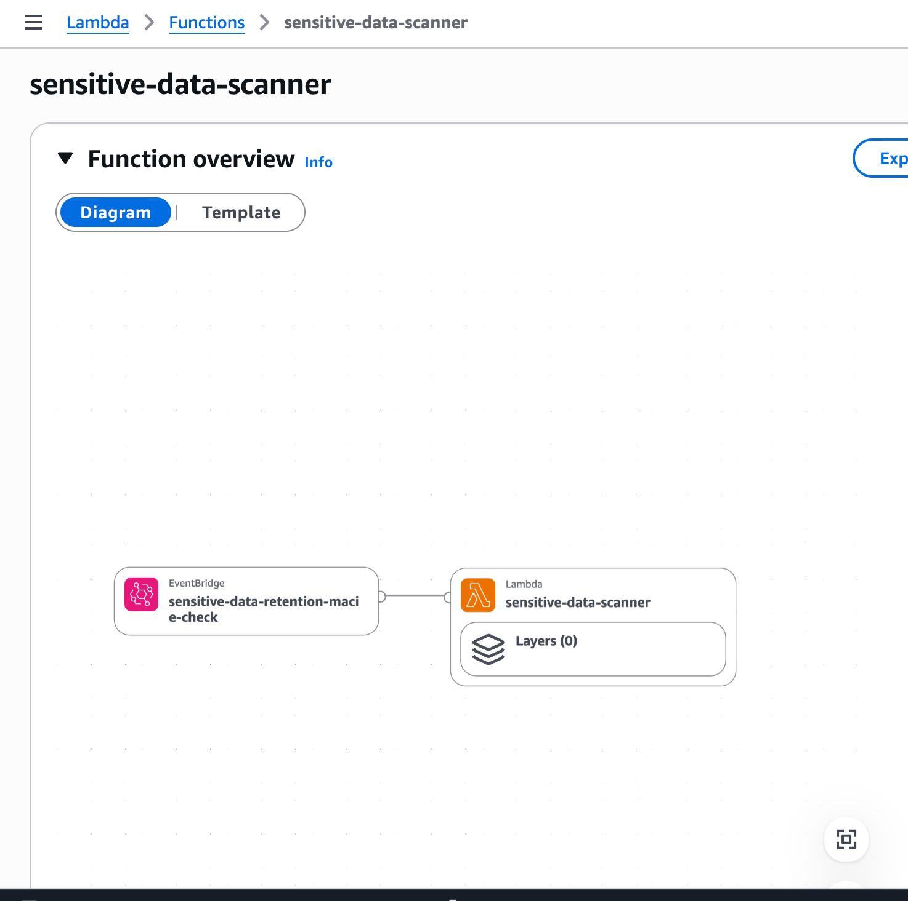
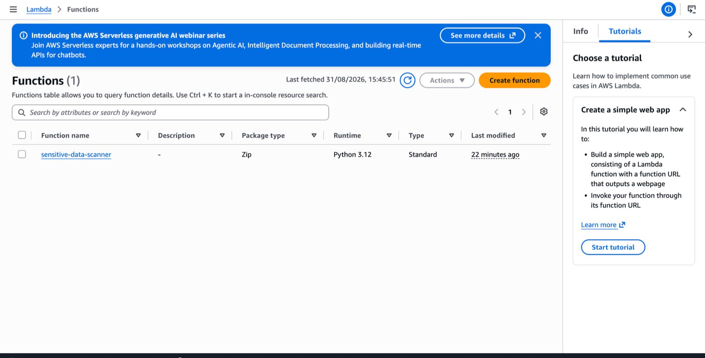
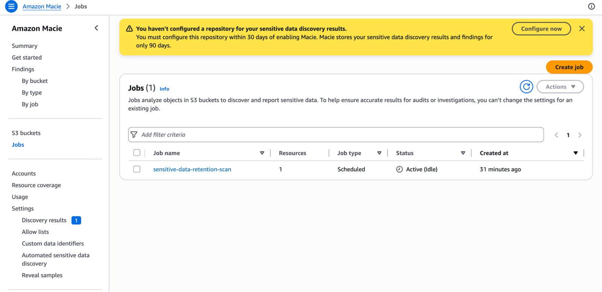
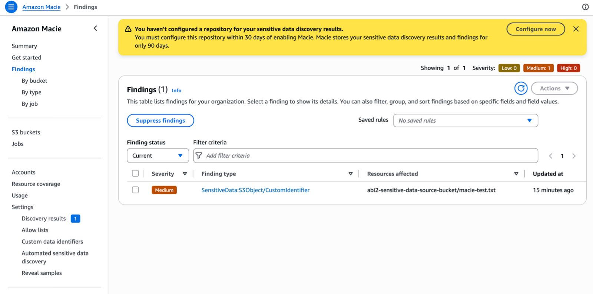
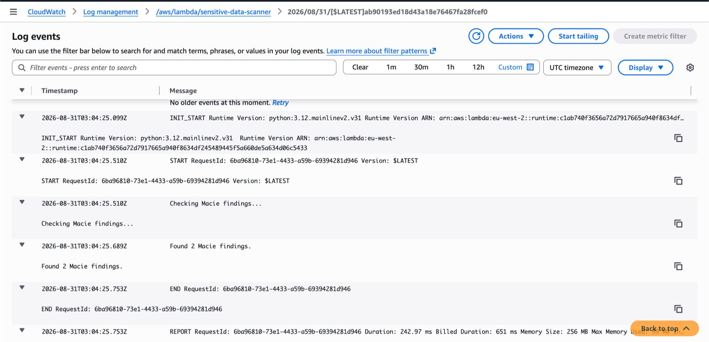
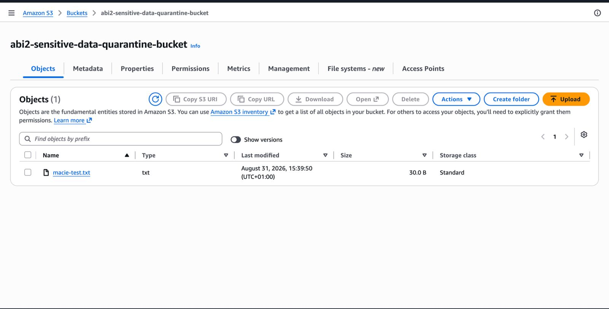

# This project identifies sensitive data in S3 and ensures that it is retained an additional 30 days before permanent deletion.

### 1. The main.tf file acts as the entry point of your Terraform configuration. The idea is to separate resources into different files, main.tf doesn't need to contain every resource. It simply ties the project together. Such that, Terraform automatically loads all .tf files in the same directory. 

### 2. The versions.tf file specifies: The minimum Terraform version required (version = "~> 6.0") and AWS as the provider (source = "hashicorp/aws").

### 3. The provider.tf file tells Terraform which cloud provider to use and which AWS Region to deploy my resources into and Instead of hardcoding the region (for example, eu-west-2 or us-east-1), I used a variable for reusability (region = var.aws_region).

### 4. The variables.tf file defines all the values that can change without modifying the Terraform code itself. This makes the project reusable and easier to maintain.

### 5. The iam.tf controls what the Lambda function is allowed to do.
1. Read objects from the source bucket
2. Write objects to the quarantine bucket
3. Delete objects if necessary
4. Write logs to CloudWatch, this helps with trouble shooting issues.
5. Access Amazon Macie findings 

### 6. The s3.tf file contains function to create the two buckets;

### 7. The lambda.tf file contains function that;
1. Packages the Python code : I made sure Terraform automatically creates the ZIP file that AWS Lambda requires.
2. Creates a CloudWatch Log Group : Just as explained From step 5, I ensured every execution of the Lambda function writes logs here.
3. Creates the Lambda Function that can;
    1. Runs Python 3.12
    2. Uses the IAM role created in iam.tf
    3. Receives the bucket names through environment variables
    4. Lastly, i wanted to make sure it can later use boto3 to inspect objects and move/store sensitive files.
4. Grants Permission: Normally, S3 cannot invoke a Lambda function. I wrote a function that tells AWS to allow a specific S3 bucket to invoke the Lambda function.
5. Configures the Trigger: As soon as a file is uploaded (deleted), the Lambda function should executes automatically.

### 8. The macie.tf file 

### 9. The lifecycle.tf file takes sensitve file sorted by lamda funtion, and kept in the quarantine bucket for 30 days, then automatically deletes it after 30 days.

